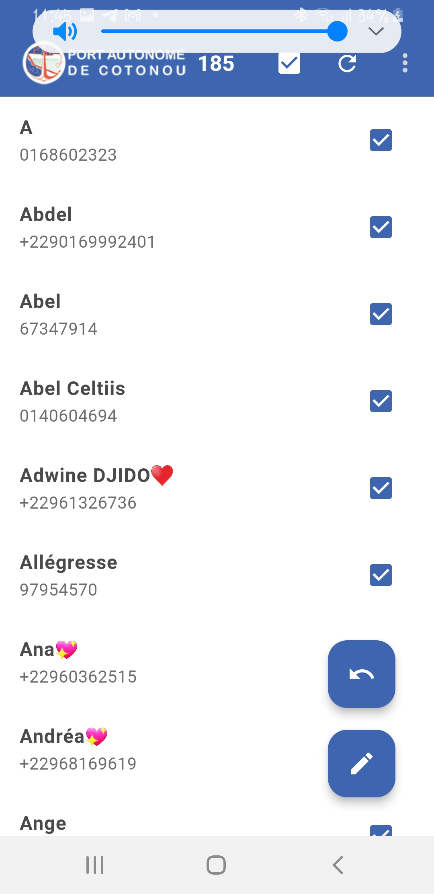
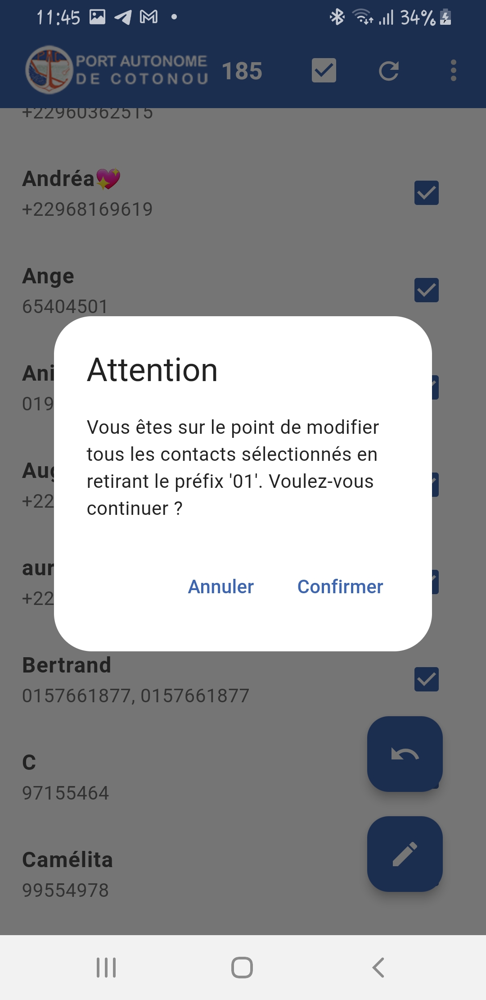

# update_contact

Cette appliaction est une application que j'ai réaliser pour le PAC (Port Autonome de Cotonou) au cours de mon stage, suite au changement du format des numéros de téléphone au Bénin qui passe à 10 chiffre mon Application permet de mettre à jour automatiquement toute les contacts enregistrer sur le numéros de téléphone de l'utilisateur et elle permet aussi  de revenir au format de base (retirer l'ajout du préfix 01)

## Getting Started

This project is a starting point for a Flutter application.

A few resources to get you started if this is your first Flutter project:

- [Lab: Write your first Flutter app](https://docs.flutter.dev/get-started/codelab)
- [Cookbook: Useful Flutter samples](https://docs.flutter.dev/cookbook)

For help getting started with Flutter development, view the
[online documentation](https://docs.flutter.dev/), which offers tutorials,
samples, guidance on mobile development, and a full API reference.
## Features

- Add new contacts
- Update existing contacts
- Delete contacts
- View contact list

## Installation

1. Clone the repository:
    ```sh
    git clone https://github.com/yourusername/update_contact.git
    ```
2. Navigate to the project directory:
    ```sh
    cd update_contact
    ```
3. Install dependencies:
    ```sh
    flutter pub get
    ```

## Usage

1. Run the app:
    ```sh
    flutter run
    ```


## License

This project is licensed under the MIT License - see the [LICENSE](LICENSE) file for details.
## Images

Here are some screenshots of the application:

### Home Screen


### Update Contact


### Remove Update
